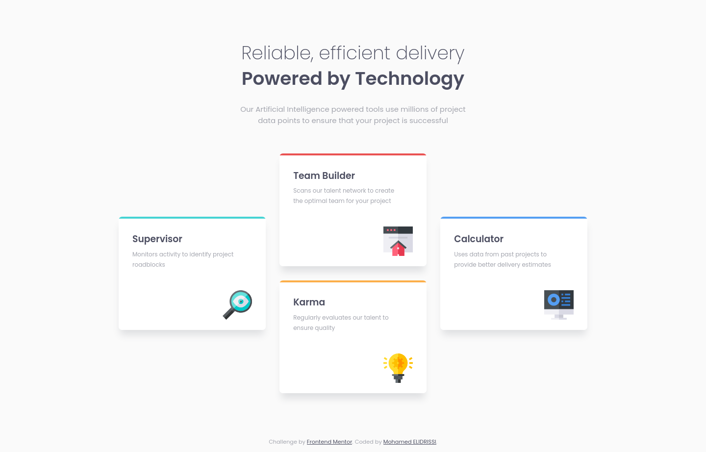

# Frontend Mentor - Four card feature section solution

This is a solution to the [Four card feature section challenge on Frontend Mentor](https://www.frontendmentor.io/challenges/four-card-feature-section-weK1eFYK). Frontend Mentor challenges help you improve your coding skills by building realistic projects. 

## Table of contents

- [Overview](#overview)
  - [The challenge](#the-challenge)
  - [Screenshot](#screenshot)
  - [Links](#links)
- [My process](#my-process)
  - [Built with](#built-with)
  - [What I learned](#what-i-learned)
  - [Continued development](#continued-development)
  - [Useful resources](#useful-resources)
- [Author](#author)
- [License](#license)

## Overview

### The challenge

Users should be able to:

- View the optimal layout for the site depending on their device's screen size

### Screenshot

| Mobile (375px) | Tablet (768px) | Desktop (1440px) |
| --- | --- | --- |
|  |  |  |

### Links

- Solution URL: [Add solution URL here](https://your-solution-url.com)
- Live Site URL: [Add live site URL here](https://your-live-site-url.com)

## My process

### Built with

- Semantic HTML5 markup
- CSS custom properties
- Flexbox
- CSS Grid
- Mobile-first workflow
- [Parcel](https://parceljs.org/)

### What I learned

Nothing special about this one, but one little detail I implemented is the colored borders on the top of the feature cards. Normally, what most people will do is set a border on the card container itself, but since the card has a `border-radius`, this means the border will also look rounded a little while the design doesn't. To overcome this, I moved the border to an inner container which means the border will not be rounded because `.card-content` isn't and I added an `overflow: hidden` to `.card` to hide the part of the border sticking out from the card.
```css
...
.card {
  ...
  border-radius: 0.5em;
  ...
  overflow: hidden;
}

.card-content {
  border-top: 0.3em solid var(--card-border-color);
  ...
}
...
```

### Continued development

This was the first time I worked with CSS Grid after a *very* long time. While I forgot the syntax, I didn't forget how dead-simple it was to create layouts with CSS Grid, so it's definitely on my list to get better at and use more for future challenges.

### Useful resources

- [A Complete Guide to Grid ](https://css-tricks.com/snippets/css/complete-guide-grid/) - CSS Tricks is the place to go to for all things CSS, this one helped me remember how to use CSS Grid. 

## Author

- Website - [Mohamed ELIDRISSI](https://www.elidrissi.dev)
- Frontend Mentor - [@elidrissidev](https://www.frontendmentor.io/profile/elidrissidev)

## License

This project is licensed under the [MIT License](LICENSE.txt).
